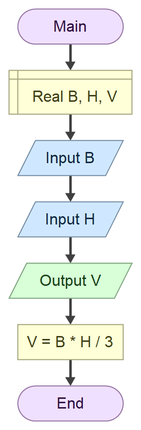

# Domaci zadatak iz Tehnicke dokumentacije

## Zadatak

Program koji na osnovu unetih duzina **dijagonala** romba d1 i d2 i **stranice** a izracunava **povrsinu** P.

## Formula

$$
V= \frac{B \cdot H}{3}
$$

### Algoritamska sema



## Resenje

```cs

using System;

class Program
{
    static void Main()
    {
        Console.Write("Unesi vrednost B: ");
        double B = double.Parse(Console.ReadLine());

        Console.Write("Unesi vrednost H: ");
        double H = double.Parse(Console.ReadLine());

        double V = (B * H) / 3;

        Console.WriteLine("Rezultat po formuli V = B * H / 3 je: " + V);
    }
}
```

### Test primeri 

test primer1:

``` text

Unesi vrednost B: 12
Unesi vrednost H: 14
Rezultat po formuli V = B * H / 3 je: 56

C:\Users\radlovacki-07\Desktop\Kontrolni3\ConsoleApp1\ConsoleApp1\bin\Debug\ConsoleApp1.exe (process 12320) exited with code 0 (0x0).
To automatically close the console when debugging stops, enable Tools->Options->Debugging->Automatically close the console when debugging stops.
Press any key to close this window . . .
```

test primer2:

``` text

Unesi vrednost B: 17.16
Unesi vrednost H: 13.56
Rezultat po formuli V = B * H / 3 je: 77.5632

C:\Users\radlovacki-07\Desktop\Kontrolni3\ConsoleApp1\ConsoleApp1\bin\Debug\ConsoleApp1.exe (process 10412) exited with code 0 (0x0).
To automatically close the console when debugging stops, enable Tools->Options->Debugging->Automatically close the console when debugging stops.
Press any key to close this window . . .
```


### Objekti

| Redni broj | Naziv promenljive | Tip promenljive |
|------------| ------------------|-----------------|
| 1.         | `B`               | `double`        |
| 2.         | `H`               | `double`        |
| 3.         | `V`               | `double`        |


